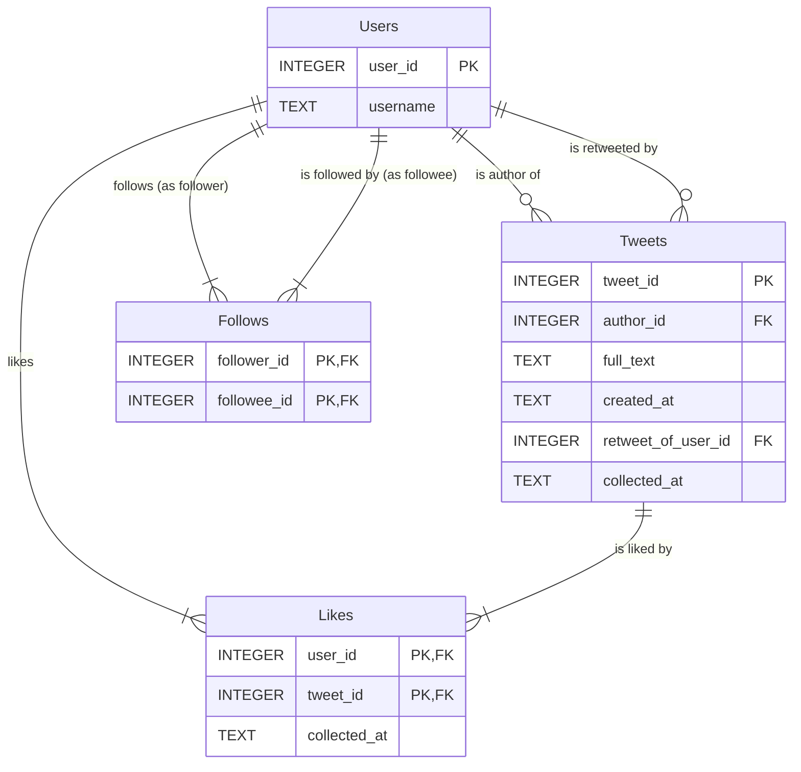

# LSS-Twon-DB
# **Social Feed Reconstruction Database (SQLite)**

## **Overview**

This project contains Python scripts to build, populate, and query an SQLite database that models a basic social media feed. The primary goal is to reconstruct a user's feed based on their social graph (follows) and all known tweets.

**Key advantages of SQLite version:**
- No separate database server required
- Single file database (portable and easy to backup)
- Built-in Python support (no external DB driver needed)
- Simplified setup and deployment

## **Prerequisites**

1. Python 3.8+
2. Python dependencies (install with: `pip install -r requirements.txt`):
   - pandas
   - numpy

## **Database Schema**

### **ER Diagram**



### **Table Descriptions**

* **Users**: Master table for all user profiles. `user_id` is the primary key.
* **Tweets**: All known tweets and retweets. `author_id` is the user who created the tweet. `retweet_of_user_id` points to the original author for retweets.
* **Follows**: Associative table for follow relationships. `follower_id` follows `followee_id`.
* **Likes**: Associative table for like relationships. `user_id` liked `tweet_id`.

**Note:** Dates are stored as TEXT in ISO 8601 format (e.g., `2024-07-22T00:00:00+00:00`).

## **Project Scripts & Workflow**

Run the scripts in the following order:

### **1. build_database.py**

* **Purpose**: Creates the SQLite database file and table schema.
* **Note**: Drops existing tables to ensure a clean build.
* **Usage**: `python3 build_database.py`
* **Output**: Creates `LSS_twon.db` in the current directory.

### **2. populate_database.py**

* **Purpose**: Reads CSV files and populates database tables.
* **Note**: File paths are hardcoded. Edit `get_file_paths()` to point to your CSVs.
* **Usage**: `python3 populate_database.py`

### **3. query_database.py**

* **Purpose**: Contains the `TwitterDBQuery` class with all query logic. Can be run directly to execute tests.
* **Usage (Testing)**: `python3 query_database.py`

### **4. test_database.py**

* **Purpose**: Standalone test suite that validates database population and query logic.
* **Usage**: `python3 test_database.py`

### **5. inspect_feed.py**

* **Purpose**: CLI tool to manually inspect a user's feed.
* **Usage**: `python3 inspect_feed.py`

## **Core Query Logic (TwitterDBQuery class)**

Key methods:

* `get_user_feed(user_id, limit=100)`: Returns tweets from the user's followees and themselves, in reverse chronological order.
* `get_user_feed_until(user_id, enddate, limit=100)`: Same as above, filtered by date.
* `get_user_posts(user_id)`: Returns all tweets/retweets authored by a single user.
* `get_user_posts_formatted(user_id)`: Returns formatted strings of user posts.
* `get_followers(user_id)`, `get_followees(user_id)`, `get_user_likes(user_id)`: Helper methods for relational data.

## **Differences from PostgreSQL Version**

**Database:**
- SQLite file (`LSS_twon.db`) instead of PostgreSQL server
- No separate database creation step
- No password/host/port configuration needed

**Data Types:**
- `INTEGER` instead of `BIGINT`
- `TEXT` instead of `TIMESTAMPTZ` (dates stored as ISO 8601 strings)

**SQL Syntax:**
- `INSERT OR IGNORE` instead of `ON CONFLICT DO NOTHING`
- `INSERT OR REPLACE` instead of `ON CONFLICT DO UPDATE`
- `?` placeholders instead of `%s`

**Python:**
- `sqlite3` (built-in) instead of `psycopg2`
- `dict_factory` instead of `RealDictCursor`
- `executemany()` instead of `execute_values()`

## **Quick Start**

```bash
# Install dependencies
pip install -r requirements.txt

# Build database
python3 build_database.py

# Populate with your data (edit file paths first)
python3 populate_database.py

# Run tests
python3 test_database.py

# Inspect feeds
python3 inspect_feed.py
```

## **File Structure**

```
.
├── LSS_twon.db              # SQLite database (created by build_database.py)
├── build_database.py        # Schema creation
├── populate_database.py     # Data import from CSVs
├── query_database.py        # Query logic and tests
├── test_database.py         # Standalone test suite
├── inspect_feed.py          # CLI feed inspector
├── requirements.txt         # Python dependencies
└── README.md               # This file
```
