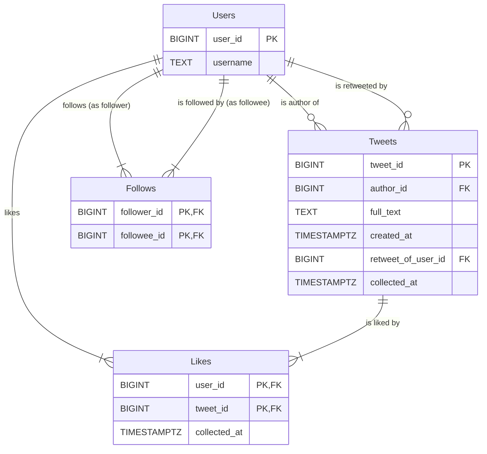

# LSS-Twon-DB
# **Social Feed Reconstruction Database**

## **Overview**

This project contains a set of Python scripts to build, populate, and query a PostgreSQL database that models a basic social media feed. The primary goal is to reconstruct a user's feed based on their social graph (follows) and all known tweets.

## **Prerequisites**

1. Python 3.8+  
2. A running PostgreSQL server  
3. Python dependencies. Create a requirements.txt file:  
   pandas  
   numpy  
   psycopg2-binary

   Install with: pip install \-r requirements.txt

## **Database Schema**

### **ER Diagram**

### **Table Descriptions**

* **Users**: Master table for all user profiles. user\_id is the primary key.  
* **Tweets**: All known tweets and retweets. author\_id is the user who created the tweet (or retweeted it). retweet\_of\_user\_id is a foreign key to Users pointing to the original author.  
* **Follows**: Associative table for the many-to-many "follow" relationship. follower\_id is the user *doing* the following, and followee\_id is the user *being* followed.  
* **Likes**: Associative table for the many-to-many "like" relationship. user\_id is the user who liked the tweet\_id.

## **Project Scripts & Workflow**

This project is intended to be run in the following order:

### **1\. build\_database.py**

* **Purpose**: Connects to the PostgreSQL server, creates the specified database (if it doesn't exist), and executes the CREATE TABLE commands for the schema.  
* **Note**: It will DROP all tables first to ensure a clean build.  
* **Usage**: python3 build\_database.py

### **2\. populate\_database.py**

* **Purpose**: Reads data from the source CSV files and populates the database tables. It handles data aggregation from multiple files and uses ON CONFLICT DO NOTHING for idempotent writes.  
* **Note**: File paths are currently hardcoded in get\_file\_paths(). You will need to edit these paths to point to your local CSVs.  
* **Usage**: python3 populate\_database.py

### **3\. query\_database.py**

* **Purpose**: Contains the core TwitterDBQuery class, which abstracts all SQL query logic. This script can also be run directly to execute the built-in test suite.  
* **Usage (Testing)**: python3 query\_database.py

### **4\. test\_database.py**

* **Purpose**: A dedicated, standalone test suite that imports TwitterDBQuery and runs a series of validation tests against a populated database to check for connection, data presence, and core query logic.  
* **Usage**: python3 test\_database.py

### **5\. inspect\_feed.py**

* **Purpose**: A user-facing CLI tool to manually inspect a user's feed. It imports TwitterDBQuery and provides a readable, formatted output for a given user\_id or username.  
* **Usage**: python3 inspect\_feed.py

## **Core Query Logic (TwitterDBQuery class)**

The query\_database.py script provides the main class for all data retrieval. Key methods include:

* get\_user\_feed(user\_id, limit=100): The primary feed reconstruction method. Returns a list of tweet dictionaries from the user's "followees" and themselves, ordered by creation date.  
* get\_user\_feed\_until(user\_id, enddate, limit=100): Same as above, but only includes tweets created on or before enddate.  
* get\_user\_posts(user\_id): Returns all tweets/retweets authored by a single user.  
* get\_user\_posts\_formatted(user\_id): Returns the output of get\_user\_posts as a list of pre-formatted strings.  
* get\_followers(user\_id), get\_followees(user\_id), get\_user\_likes(user\_id): Helper methods for retrieving specific relational data.
